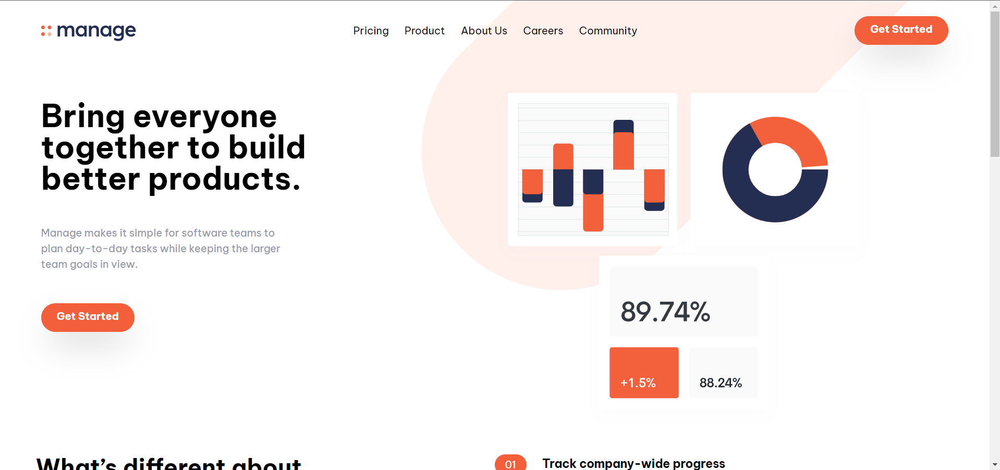

# Frontend Mentor - Manage landing page solution

This is a solution to the
[Manage landing page challenge on Frontend Mentor](https://www.frontendmentor.io/challenges/manage-landing-page-SLXqC6P5).
Frontend Mentor challenges help you improve your coding skills by building
realistic projects.

## Table of contents

- [Overview](#overview)
  - [The challenge](#the-challenge)
  - [Screenshot](#screenshot)
  - [Links](#links)
- [My process](#my-process)
  - [Built with](#built-with)
  - [What I learned](#what-i-learned)
  - [Useful resources](#useful-resources)

**Note: Delete this note and update the table of contents based on what sections
you keep.**

## Overview

### The challenge

Users should be able to:

- View the optimal layout for the site depending on their device's screen size
- See hover states for all interactive elements on the page
- See all testimonials in a horizontal slider
- Receive an error message when the newsletter sign up `form` is submitted if:
  - The `input` field is empty
  - The email address is not formatted correctly

### Screenshot

### Links

- Solution URL: [Add solution URL here](https://your-solution-url.com)
- Live Site URL: [Add live site URL here](https://your-live-site-url.com)

## My process

### Built with

- Semantic HTML5 markup
- CSS custom properties
- Flexbox
- Tailwindcss
- Mobile-first workflow s\*\*

### What I learned

I learn from this challeng ehow to use tailwindcss, hat's was the first project
for me with tailwind

### Useful resources

- [Example resource 1](https://tailwindcss.com/docs/installation) - This helped
  me for understand the css rule that all tailwind classes used
- [Example resource 2](https://www.youtube.com/watch?v=dFgzHOX84xQ&t=141s) -
  This is an amazing Video for explain how to use tailwo,d for the first time.
